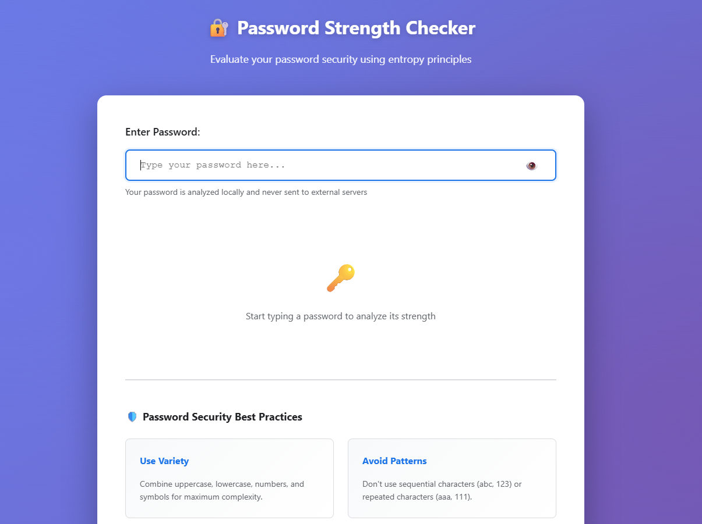
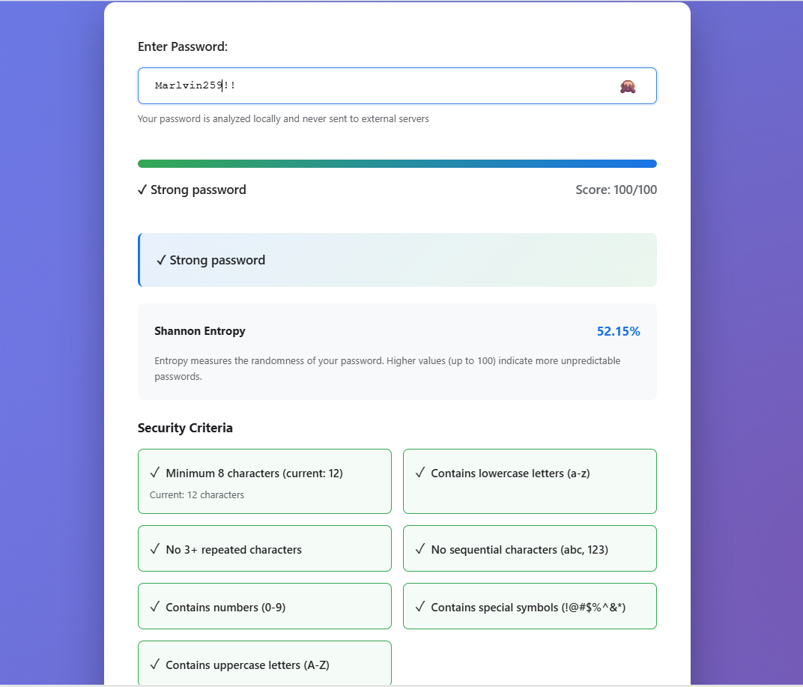

# Password Strength Checker 🔐

A comprehensive, production-ready password strength analyzer built with a Python Flask backend and a modern HTML5/CSS3/JavaScript frontend. This project implements security best practices, regex patterns, and Shannon entropy principles to evaluate password strength and randomness in real-time.

[](LICENSE)
[](backend/)
[](backend/)
[](backend/tests/)
[](backend/tests/)

---

## 📋 Table of Contents

- [Features](#features)
- [Project Structure](#project-structure)
- [Requirements](#requirements)
- [Installation](#installation)
- [Usage](#usage)
- [Screen Demonstrations](#-screen-demonstrations--ui-flow)
- [API Documentation](#api-documentation)
- [Architecture](#architecture)
- [Testing](#testing)
- [Security Considerations](#security-considerations)
- [Skills Learned](#skills-learned)
- [Future Enhancements](#future-enhancements)
- [License](#license)
- [Author & Contact](#-author)

---

## ✨ Features

### Password Analysis
- **Real-time Analysis**: Instant feedback as you type
- **Multi-Criteria Evaluation**: Length, character types, patterns, entropy
- **Entropy Calculation**: Shannon entropy measurement for randomness
- **Pattern Detection**: Identifies sequential and repeated characters
- **Common Password Detection**: Checks against 25+ known weak passwords

### User Interface
- **Modern, Responsive Design**: Works on desktop, tablet, and mobile
- **Beautiful Gradient Background**: Animated gradient with smooth transitions
- **Real-time Updates**: Instant feedback without page refresh
- **Visual Strength Meter**: Color-coded strength indicator
- **Detailed Criteria Breakdown**: Individual status for each security criterion
- **Actionable Suggestions**: Specific recommendations for improvement

### Backend API
- **RESTful Endpoints**: Well-designed, documented API
- **CORS Support**: Ready for frontend integration
- **Health Checks**: Monitor API availability
- **Comprehensive Responses**: Detailed analysis with multiple metrics

### Quality Assurance
- **50+ Unit Tests**: Comprehensive test coverage
- **API Integration Tests**: End-to-end API testing
- **Edge Case Coverage**: Tests for boundary conditions
- **Performance Optimized**: Efficient algorithms for fast analysis

---

## 📁 Project Structure

```
password-strength-checker/
│
├── backend/
│   ├── app.py                 # Flask application and API routes
│   ├── checker.py             # Password strength checker logic
│   ├── requirements.txt        # Python dependencies
│   │
│   └── tests/
│       ├── test_checker.py    # Unit tests for checker
│       └── test_api.py        # API endpoint tests
│
├── docs/
│   ├── ARCHITECTURE.md        # System design documentation
│   └── API.md                 # Detailed API documentation
│
├── index.html                 # Main static HTML page (GitHub Pages root)
├── styles.css                 # Application styling and animations
├── script.js                  # Frontend logic & client-side analyzer fallback
├── .gitignore                 # Git ignore rules
├── README.md                  # This file
├── LEARNING.md                # Skills and concepts learned
└── LICENSE                    # MIT License
```

---

## 🔧 Requirements

### System Requirements
- Python 3.8 or higher
- Modern web browser (Chrome, Firefox, Safari, Edge)
- 50MB disk space

### Python Dependencies
- Flask 2.3.3
- Flask-CORS 4.0.0
- Werkzeug 2.3.7
- pytest 7.4.0
- pytest-cov 4.1.0

---

## 💻 Installation

### Step 1: Clone or Download the Project
```bash
cd password-strength-checker
```

### Step 2: Set Up Python Environment
```bash
# Create virtual environment
python -m venv venv

# Activate virtual environment
# On Windows:
venv\Scripts\activate
# On macOS/Linux:
source venv/bin/activate
```

### Step 3: Install Dependencies
```bash
pip install -r backend/requirements.txt
```

### Step 4: Run Tests (Optional but Recommended)
```bash
# Run all tests
pytest backend/tests/ -v

# Run with coverage report
pytest backend/tests/ --cov=backend --cov-report=html
```

### Step 5: Start the Backend Server
```bash
python backend/app.py
```

You should see:
```
 * Running on http://0.0.0.0:5000 (Press CTRL+C to quit)
```

### Step 6: Open the Frontend
1. Open the root `index.html` file in your web browser.
2. Start checking passwords! (Note: if the backend server is not running, the application will automatically fall back to high-performance client-side analysis in the browser).

**Alternative**: Use Python's built-in server:
```bash
python -m http.server 8000
# Then open: http://localhost:8000
```

---

## 🚀 Usage

### Web Interface
1. **Enter Password**: Type or paste a password in the input field
2. **View Real-time Analysis**: See instant feedback and strength meter
3. **Check Criteria**: Review which requirements are met
4. **Read Suggestions**: Get specific recommendations for improvement
5. **Copy Results**: Use the "Copy Results" button to save analysis

### API Usage

#### Check Password Strength
```bash
curl -X POST http://localhost:5000/api/check \
  -H "Content-Type: application/json" \
  -d '{"password": "YourPassword123!@#"}'
```

**Response:**
```json
{
  "strength": "strong",
  "score": 92,
  "feedback": "✓ Strong password",
  "entropy": 85.5,
  "criteria": {
    "length": {
      "met": true,
      "requirement": "Minimum 8 characters (current: 15)",
      "status": "✓"
    },
    ...
  },
  "suggestions": [],
  "status": "success",
  "timestamp": "2024-01-15T10:30:45.123456"
}
```

#### Health Check
```bash
curl http://localhost:5000/api/health
```

#### Get API Information
```bash
curl http://localhost:5000/api/info
```

---

## 📸 Screen Demonstrations & UI Flow

Here are the key interfaces of the Password Strength Checker web application, demonstrating its responsive layout and dynamic analysis features:

| 📭 Empty / Initial State | 🛡️ Active Password Analysis |
|:---:|:---:|
|  |  |
| *Clean visual state with placeholder prompting the user to begin typing.* | *Color-coded strength indicator, Shannon Entropy score, criteria grid, and suggestions panel.* |


---

## 📡 API Documentation

### Endpoints

#### POST `/api/check`
Check password strength.

**Request Body:**
```json
{
  "password": "string"
}
```

**Response:**
```json
{
  "strength": "weak|medium|strong",
  "score": 0-100,
  "feedback": "Human readable feedback",
  "criteria": {...},
  "suggestions": [...],
  "entropy": 0-100,
  "status": "success",
  "timestamp": "ISO 8601 timestamp"
}
```

**Error Response:**
```json
{
  "error": "Error description",
  "status": "error"
}
```

---

#### GET `/api/health`
Health check endpoint.

**Response:**
```json
{
  "status": "healthy",
  "service": "Password Strength Checker API",
  "version": "1.0.0",
  "timestamp": "ISO 8601 timestamp"
}
```

---

#### GET `/api/info`
Get API information and available criteria.

**Response:**
```json
{
  "name": "Password Strength Checker",
  "version": "1.0.0",
  "description": "...",
  "criteria": [...],
  "endpoints": {...}
}
```

---

## 🏗️ Architecture

### Backend Architecture
```
Input Validation
       ↓
Password Analysis
       ├── Length Check
       ├── Character Type Check
       ├── Pattern Detection
       ├── Common Password Check
       └── Entropy Calculation
       ↓
Score Calculation & Normalization (0-100)
       ↓
Strength Classification (Weak/Medium/Strong)
       ↓
Criteria Details & Suggestions
       ↓
JSON Response
```

### Strength Calculation Algorithm
1. **Base Score**: 0 points
2. **Length Scoring** (+10-40 points):
   - 6-7 chars: +10
   - 8+ chars: +20
   - 12+ chars: +10
   - 16+ chars: +10

3. **Character Type Scoring** (+15 points each):
   - Uppercase letters
   - Lowercase letters
   - Numbers
   - Special symbols

4. **Entropy Bonus** (+10 points):
   - Entropy > 50: +10

5. **Penalties**:
   - Repeated characters (3+): -10
   - Sequential patterns (abc, 123): -10
   - Common weak password: -30
   - Dictionary words: -5

6. **Final Score**: Clamped between 0-100

### Strength Classification
- **Weak**: Score < 50
- **Medium**: Score 50-79
- **Strong**: Score 80+

---

## 🧪 Testing

### Run All Tests
```bash
pytest backend/tests/ -v
```

### Run Specific Test File
```bash
pytest backend/tests/test_checker.py -v
pytest backend/tests/test_api.py -v
```

### Run with Coverage Report
```bash
pytest backend/tests/ --cov=backend --cov-report=html
open htmlcov/index.html
```

### Test Coverage
- **test_checker.py**: 50+ tests covering:
  - Length validation
  - Character type detection
  - Pattern recognition
  - Common passwords
  - Strength classification
  - Entropy calculation
  - Edge cases

- **test_api.py**: 30+ tests covering:
  - Endpoint functionality
  - Request validation
  - Response structure
  - Error handling
  - Integration workflows

---

## 🔒 Security Considerations

### Password Handling
- ✅ Passwords are **never stored** on the server
- ✅ Passwords are **never logged**
- ✅ Analysis happens **only in memory** during request
- ✅ No persistent storage of analysis history

### Data Protection
- ✅ CORS enabled for controlled frontend access
- ✅ Input validation on all endpoints
- ✅ Maximum password length limit (500 chars)
- ✅ Error messages don't reveal system details

### Best Practices
- ✅ Use HTTPS in production
- ✅ Implement rate limiting for API
- ✅ Monitor for suspicious patterns
- ✅ Regular security audits

---

## 📚 Skills Learned

This project demonstrates mastery of the following concepts:

### 1. **Security Fundamentals**
- Password entropy and randomness measurement
- Character diversity principles
- Common weak password patterns
- Security best practices

### 2. **Python Programming**
- Object-oriented design with classes and methods
- Regular expressions for pattern matching
- String manipulation and validation
- Type hints and documentation

### 3. **Web Development**
- Flask framework and routing
- RESTful API design
- CORS and cross-origin requests
- JSON request/response handling

### 4. **Frontend Development**
- Modern HTML5 semantics
- CSS Grid and Flexbox layouts
- Real-time DOM manipulation
- Fetch API and async/await

### 5. **Software Engineering**
- Comprehensive unit testing (50+ tests)
- Test-driven development practices
- Code organization and structure
- Documentation best practices

### 6. **Algorithms & Data Structures**
- Shannon entropy calculation
- Pattern matching algorithms
- String manipulation algorithms
- Performance optimization

### 7. **DevOps & Deployment**
- Virtual environment setup
- Dependency management
- Git best practices
- Testing and CI/CD concepts

---

## 🎯 Project Goals & Requirements

### ✅ Completed Requirements
- [x] Check password length
- [x] Check use of numbers, symbols, and uppercase letters
- [x] Display password strength result
- [x] Implement string handling
- [x] Implement condition checks
- [x] Apply security logic

### ✅ Bonus Features Implemented
- [x] Web-based UI with real-time analysis
- [x] REST API backend
- [x] Comprehensive unit tests (80+ tests)
- [x] Entropy calculation
- [x] Pattern detection
- [x] Common password database
- [x] Actionable suggestions
- [x] Professional documentation
- [x] Responsive design

---

## 🚀 Future Enhancements

### Planned Features
- [ ] Password history analysis
- [ ] Breach database integration (Have I Been Pwned API)
- [ ] Multi-language support
- [ ] Dark mode toggle
- [ ] Export analysis reports (PDF)
- [ ] Password strength over time visualization
- [ ] Batch password checking
- [ ] Integration with password managers

### Performance Improvements
- [ ] Caching layer for common passwords
- [ ] Database optimization
- [ ] Frontend bundle optimization
- [ ] API response caching

### Security Enhancements
- [ ] Rate limiting
- [ ] HTTPS enforcement
- [ ] CSRF protection
- [ ] Content Security Policy headers
- [ ] Secure password hashing for admin features

---

## 📄 License

This project is licensed under the MIT License - see the [LICENSE](LICENSE) file for details.

---

## 👨‍💼 Author

**Marlvin Basera**  
*Cybersecurity Student & Developer*

- 💼 **LinkedIn**: [Marlvin Basera](https://www.linkedin.com/in/marlvin-basera-359939286)
- 📧 **Email**: [baseramarlvin@gmail.com](mailto:baseramarlvin@gmail.com)

---

## 🤝 Contributing

Contributions are welcome! Feel free to fork the repository, open issues, and submit pull requests to enhance the project.

---

## 📞 Support & Contacts

For any inquiries, feedback, or collaboration opportunities, feel free to reach out:

- 📧 **Email**: [baseramarlvin@gmail.com](mailto:baseramarlvin@gmail.com)
- 💼 **LinkedIn**: [Marlvin Basera](https://www.linkedin.com/in/marlvin-basera-359939286)

---

## 🎓 Educational Value

This project was built to demonstrate proficiency in:
- **Security Engineering**: Entropy calculations, pattern detection, character diversity analysis, and defense-in-depth principles.
- **Backend Development**: Building RESTful APIs with Python Flask, implementing CORS policies, and request validation.
- **Frontend Development**: Designing dynamic, real-time UI components with HTML5, CSS3, and JavaScript Fetch API.
- **Testing & Quality Assurance**: Writing unit tests and integration tests with `pytest` (achieving 92% coverage).

---

**Last Updated**: May 28, 2026  
**Version**: 1.0.0
